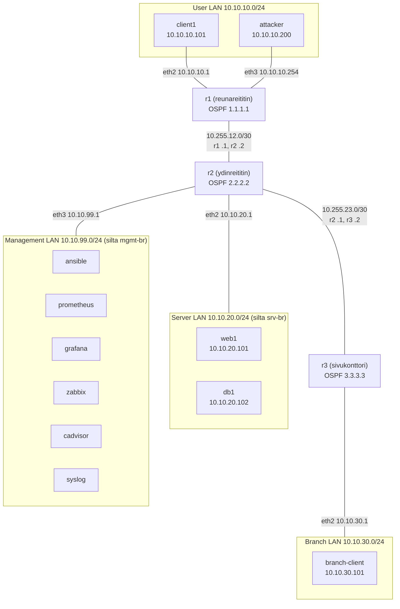

# Viikko 1: Verkon dokumentointi

## 1. Johdanto

Kurssin ympäristö on Containerlabilla toteutettu virtuaalinen yritysverkko. Siinä on kolme FRRouting-reititintä, käyttäjä-, palvelin-, sivukonttori- ja hallintaverkot sekä verkonhallinnan palvelut (Ansible, Prometheus, Grafana, Zabbix ja NetBox). Ympäristöä käytetään kurssin harjoituksissa dokumentoinnin, valvonnan, automaation ja tietoturvan harjoitteluun.

Tämä raportti dokumentoi ympäristön rakenteen, IP-osoitteistuksen ja reitityksen. Kaikki tiedot on kerätty käynnissä olevasta ympäristöstä komennoilla `containerlab inspect`, `ip addr`, `ip route`, `ping`, `traceroute` ja `vtysh -c "show ip route"`. Lähdetiedostot ovat `reports`-kansiossa.

## 2. Verkkokaavio



Lisäksi jokainen kontti on liitetty eth0-rajapinnallaan Containerlabin hallintaverkkoon 172.20.20.0/24, jota kaavio ei näytä. Hallintaverkon palveluilla ei ole IPv4-osoitetta 10.10.99.0/24-verkossa (ks. osio 4).

## 3. Laiteluettelo

| Laite | Image | Tarkoitus | Datatason osoite | clab-mgmt-osoite |
|---|---|---|---|---|
| r1 | frrouting/frr | Reunareititin. Käyttäjäverkon yhdyskäytävä, mainostaa oletusreitin OSPF:llä. | 10.10.10.1, 10.10.10.254, 10.255.12.1 | 172.20.20.8 |
| r2 | frrouting/frr | Ydinreititin. Palvelin- ja hallintaverkon yhdyskäytävä, yhdistää r1:n ja r3:n. | 10.10.20.1, 10.10.99.1, 10.255.12.2, 10.255.23.1 | 172.20.20.7 |
| r3 | frrouting/frr | Sivukonttorin reititin. Sivukonttorin verkon yhdyskäytävä. | 10.10.30.1, 10.255.23.2 | 172.20.20.5 |
| client1 | ubuntu:24.04 | Käyttäjäverkon työasema, käytetään yhteys- ja reititystesteihin. | 10.10.10.101 | 172.20.20.3 |
| attacker | kali-rolling | Kali Linux -kone tietoturvatestaukseen (esim. porttiskannaus). | 10.10.10.200 | 172.20.20.4 |
| web1 | ubuntu:24.04 | Verkkopalvelin palvelinverkossa. | 10.10.20.101 | 172.20.20.12 |
| db1 | ubuntu:24.04 | Tietokantapalvelin palvelinverkossa. | 10.10.20.102 | 172.20.20.15 |
| branch-client | ubuntu:24.04 | Sivukonttorin työasema. | 10.10.30.101 | 172.20.20.6 |
| ansible | ubuntu:24.04 | Ansible-hallintakone (control node) automaatiota varten. | ei osoitetta | 172.20.20.16 |
| prometheus | prom/prometheus | Metriikoiden keruu ja tallennus, portti 9090. | ei osoitetta | 172.20.20.2 |
| grafana | grafana/grafana | Metriikoiden visualisointi, portti 3000. | ei osoitetta | 172.20.20.10 |
| zabbix | zabbix-appliance | Keskitetty valvonta ja hälytykset, portti 8080. | ei osoitetta | 172.20.20.9 |

Muut ympäristön osat: cadvisor (konttien metriikat Prometheukselle), syslog (keskitetty lokipalvelin, kiinteä osoite 172.20.20.50), srv-bp ja mgmt-bp (Linux-sillat palvelin- ja hallintaverkoille) sekä NetBox (erillinen Docker Compose -pino, portti 8000).

clab-mgmt-osoitteet jaetaan dynaamisesti, joten ne voivat vaihtua ympäristön uudelleenkäynnistyksessä. Lähde: `reports/inspect.txt`.

## 4. IP-suunnitelma

| Verkko | Tarkoitus | Yhdyskäytävä | Laitteet |
|---|---|---|---|
| 10.10.10.0/24 | User LAN, käyttäjäverkko | r1 10.10.10.1 | client1 .101, attacker .200 |
| 10.10.20.0/24 | Server LAN, palvelinverkko | r2 10.10.20.1 | web1 .101, db1 .102 |
| 10.10.30.0/24 | Branch LAN, sivukonttori | r3 10.10.30.1 | branch-client .101 |
| 10.10.99.0/24 | Management LAN, hallintaverkko | r2 10.10.99.1 | ei muita IPv4-osoitteita |
| 10.255.12.0/30 | Siirtoyhteys r1-r2 | ei (point-to-point) | r1 .1, r2 .2 |
| 10.255.23.0/30 | Siirtoyhteys r2-r3 | ei (point-to-point) | r2 .1, r3 .2 |
| 172.20.20.0/24 | Containerlabin hallintaverkko (clab-mgmt) | 172.20.20.1 (Docker) | kaikki kontit, syslog .50 |

Havainnot:

- 10.10.99.0/24 (Management LAN): ainoa IPv4-osoite on r2:n 10.10.99.1. Hallintapalveluilla (ansible, prometheus, grafana, zabbix) ei ole osoitetta tässä verkossa, vaan ne liikennöivät Containerlabin hallintaverkon 172.20.20.0/24 kautta. Lähde: `reports/ip-addr.txt`.
- r1:llä aliverkko 10.10.10.0/24 on kahdessa rajapinnassa: eth2 (10.10.10.1, client1) ja eth3 (10.10.10.254, attacker). attackerin oletusyhdyskäytäväksi on kuitenkin määritetty 10.10.10.1, joka on eri rajapinnassa kuin attackerin oma linkki.
- Reitittimien oletusreitti kulkee eth0-rajapinnan kautta osoitteeseen 172.20.20.1, ja reitittimet NATtaavat sisäverkkojen liikenteen ulos.

## 5. Reitityksen analyysi

Testit ajettiin client1-laitteelta (10.10.10.101). Täydet tulosteet: `reports/routing-client1.txt` ja `reports/routing-routers.txt`.

### client1:n reititystaulu

```
default via 10.10.10.1 dev eth1
10.10.10.0/24 dev eth1 proto kernel scope link src 10.10.10.101
172.20.20.0/24 dev eth0 proto kernel scope link src 172.20.20.3
```

client1:n oletusyhdyskäytävä on r1 (10.10.10.1). eth0 on kytketty Containerlabin hallintaverkkoon 172.20.20.0/24.

### Yhteystestit

| Kohde | Tulos | TTL | Päätelmä |
|---|---|---|---|
| web1 10.10.20.101 | 4/4 vastausta, 0 % häviö | 62 | 2 reititintä välissä (r1, r2) |
| branch-client 10.10.30.101 | 4/4 vastausta, 0 % häviö | 61 | 3 reititintä välissä (r1, r2, r3) |

Linuxin TTL:n lähtöarvo on 64, ja jokainen reititin vähentää sitä yhdellä.

### Traceroute branch-clientille

```
 1  10.10.10.1     (r1, eth2)
 2  10.255.12.2    (r2, eth1)
 3  10.255.23.2    (r3, eth1)
 4  10.10.30.101   (branch-client)
```

Liikenne kulkee reittiä client1 → r1 → r2 → r3 → branch-client.

### Reitittimien reititystaulut

- Reitittimet käyttävät OSPF:ää (area 0). Jokainen reititin tuntee kaikki kuusi 10.x-verkkoa: suoraan kytketyt verkot (C) ja OSPF:llä opitut (O).
- OSPF-kustannus kasvaa 10 jokaista linkkiä kohden. Esimerkiksi r1:llä reitti 10.10.30.0/24 on [110/30], eli kolme linkkiä.
- r1 mainostaa oletusreitin OSPF:llä (`default-information originate always`). r2 ja r3 eivät kuitenkaan käytä sitä, koska jokaisella reitittimellä on kernelin oletusreitti 172.20.20.1 (eth0), jonka hallinnollinen etäisyys 0 voittaa OSPF:n arvon 110.
- r1:llä aliverkko 10.10.10.0/24 on kytketty kahteen rajapintaan: eth2 (client1, 10.10.10.1) ja eth3 (attacker, 10.10.10.254). FRR valitsee eth2:n ensisijaiseksi reitiksi.

### Johtopäätös

client1:ltä on yhteys sekä palvelinverkkoon että sivukonttorin verkkoon. Reititys toimii OSPF:n avulla, ja traceroute vastaa topologian rakennetta.

## 6. Yhteenveto

### Mikä vei eniten aikaa ja miksi?

Eniten aikaa vei ympäristön käyttöönotto. Ubuntu ei asentunut WSL:ään ensimmäisellä yrityksellä, ja NetBoxin ensimmäinen käynnistys ylitti terveystarkistuksen aikarajan, koska tietokantamigraatiot kestivät pitkään. Varsinaisessa dokumentoinnissa aikaa vei hallintaverkon todellisen tilan selvittäminen. Kurssirepon dokumentaatio, NetBoxin data ja käynnissä olevan ympäristön tila eivät vastanneet toisiaan, joten osoitteet piti tarkistaa jokaisesta laitteesta erikseen.

### Miten dokumentaatio auttaa palvelusta vastaavaa IT-asiantuntijaa?

Ajantasainen dokumentaatio nopeuttaa vianetsintää, koska ylläpitäjä tietää heti, mitä reittiä liikenne kulkee ja mikä laite toimii minkäkin verkon yhdyskäytävänä. Se helpottaa myös muutosten suunnittelua ja perehdytystä, koska ympäristön rakenne ei ole yksittäisen henkilön muistin varassa.

Tämän harjoituksen tärkein havainto on, että dokumentaatio on hyödyllistä vain, jos se vastaa todellisuutta. NetBoxiin seedatut osoitteet 10.10.99.10, .20, .30 ja .40 eivät vastaa ympäristön todellista tilaa. Tämä on esimerkki Single Source of Truth -ongelmasta: kun sama tieto on useassa paikassa, osa lähteistä vanhenee tai on alun perinkin väärin. Siksi dokumentaatio kannattaa tuottaa mahdollisimman pitkälle suoraan ympäristöstä mitatusta tiedosta.